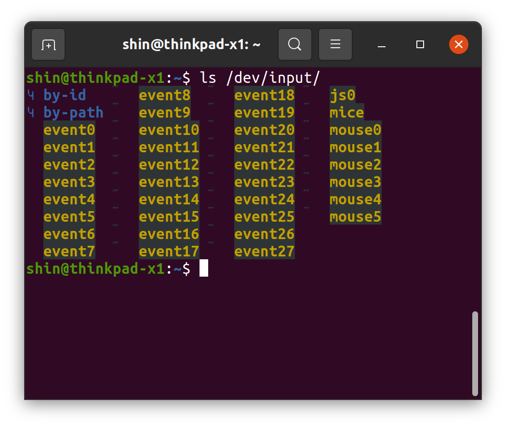

# DUALSHOCK4
DUALSHOCK4とはPlayStation 4専用のワイヤレスコントローラーのことで、ROSによる操作にも利用することができる。

## ROSのjoyパッケージのインストール
```
$ sudo apt-get install ros-${ROS_DISTRO}-joy
```

## 接続方法
### ds4drvのインストール
DUALSHOCK4とUbuntuをペアリングするPythonドライバのds4drvをインストールする。
```
$ sudo pip install ds4drv
```

### Ubuntuとのペアリング
Ubuntu側でBluetoothをONにしてターミナルで
```
$ sudo ds4drv
```
と打つ。
DUALSHOCK4の「PSボタン」と「SHARE」ボタンを同時に10秒くらい押し続けてしばらくするとコントローラ背後のライトバーがチカチカッ、チカチカッという感じで白く点滅する。こうなったらもうボタンから手を話してOK。
下記のような表示が出て、ライトバーが青く点灯すればペアリング完了。  
[info][bluetooth] Found device xx:xx:xx:xx:xx:xx  
[info][controller 1] Connected to Bluetooth Controller (xx:xx:xx:xx:xx:xx)

### ノードの起動
```
$ rosrun joy joy_node

```

## 補足
### 有線接続
DUALSOHCK4は有線接続でも使用することが可能である。その場合、ds4drvは必要なくjoy_nodeを起動するだけで良い。  
特に、Bluetoothデバイスの相性によってはds4drvがうまく動かない場合があるようで、安定性を求める場合は有線接続が推奨される。

### デバイスファイル生成失敗
DUALSHOCK4を含めjoyコントローラーをUbuntuに接続した際、通常は以下のように`/dev/input/`配下にデバイスファイル`js0`が生成される。



しかし、Ubuntuとの接続時になんらかの理由によりうまくデバイスファイルが生成されず、代わりに`js0`という名前のディレクトリが生成されることがある。(画像中js0の文字が黄色ではなく青で表示される)  
その場合は
```
$ sudo rmdir /dev/input/js0
```
と一度ディレクトリを削除し、もう一度Ubuntuとの接続のやり直しを実施する。
